# 8-5 盤點作業刷讀

庫存管理→盤點作業\_刷讀→上傳盤點資料→產出差異報表→倉庫實際複盤→調整帳差\(商品出庫/商品入庫\)

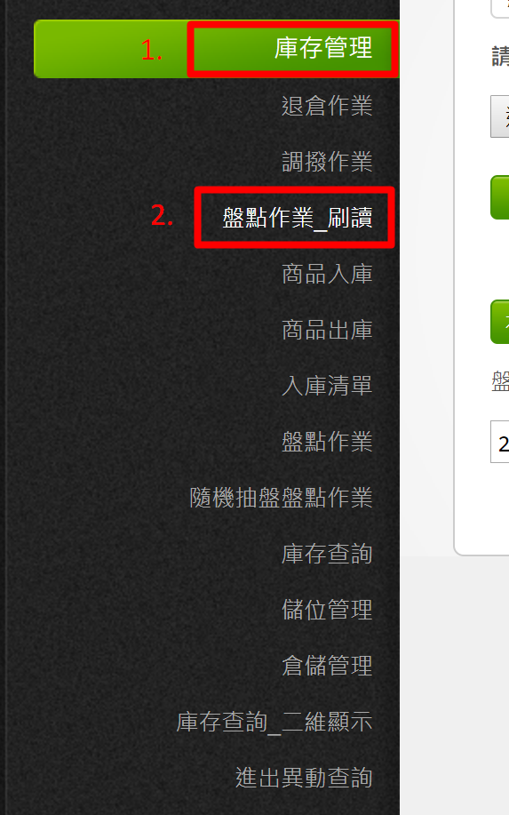

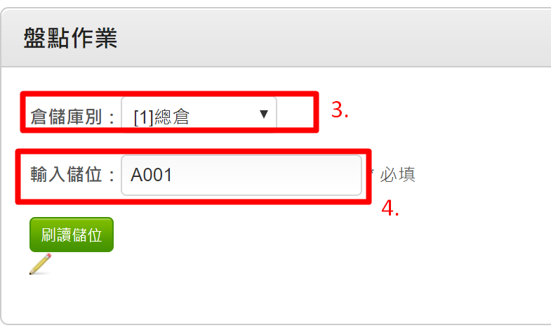

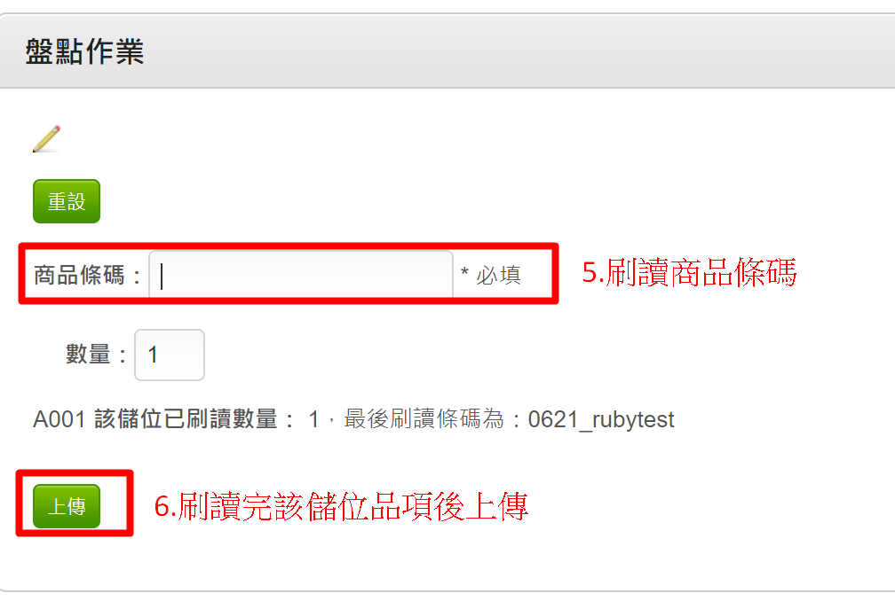

上傳盤點資料

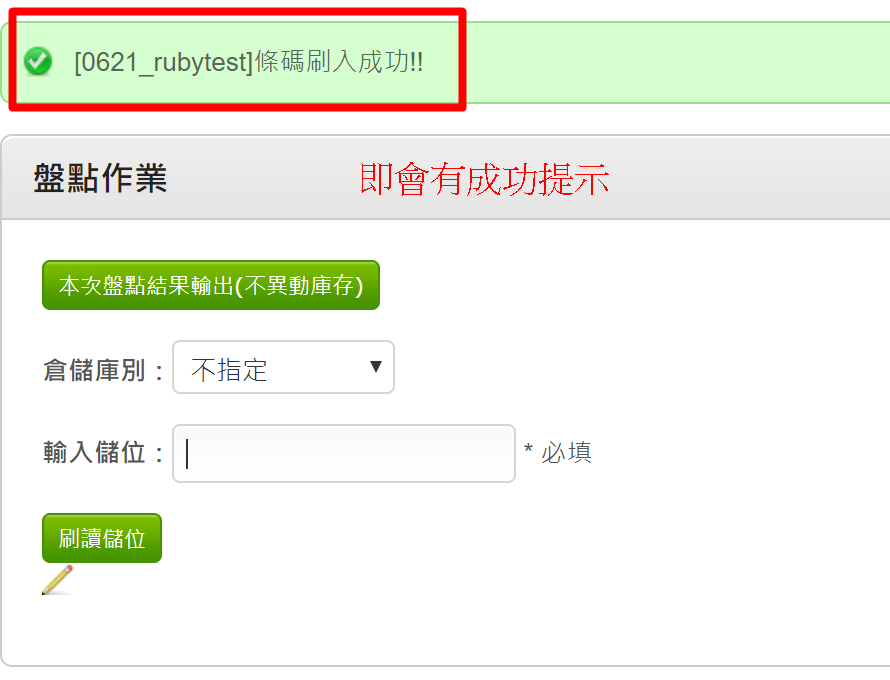

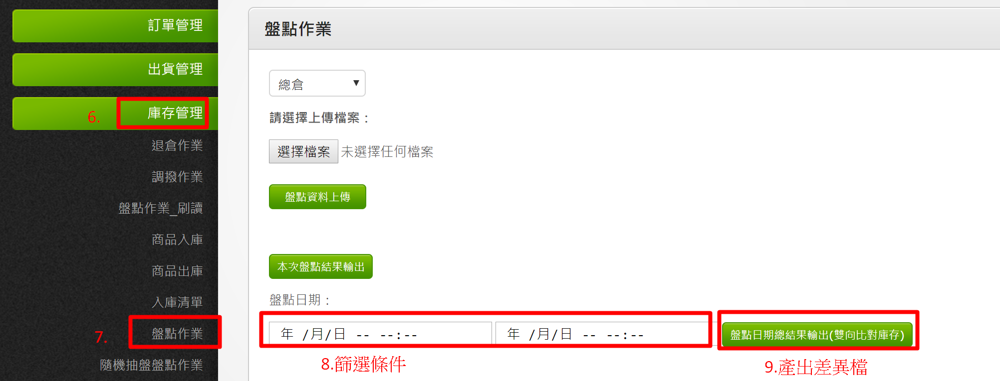

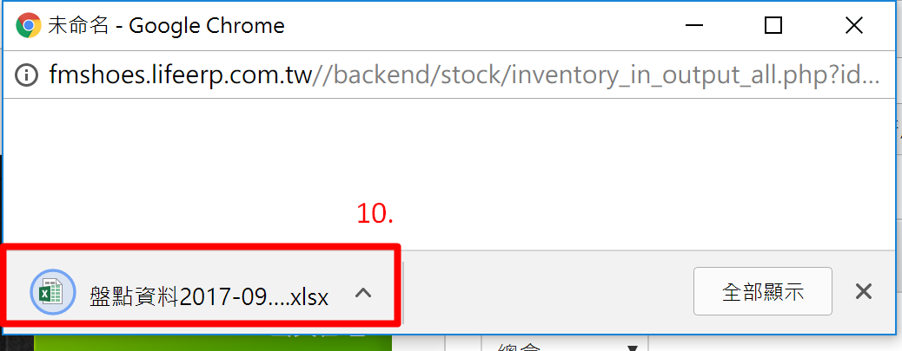

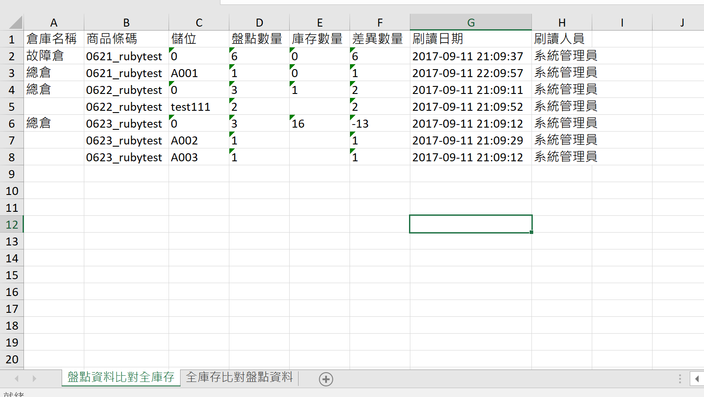

盤點資料比對全庫存

將此次篩選條件內的全盤點資料列出，並且比對系統的該倉別該儲位的庫存數量，產出差異。

全庫存比對盤點資料

將此次篩選條件內的全盤點資料列出，並且比對系統相同SKU的庫存數量，產出差異。

倉庫實際複盤

調整帳差\(商品出庫/商品入庫\)

盤盈→商品入庫

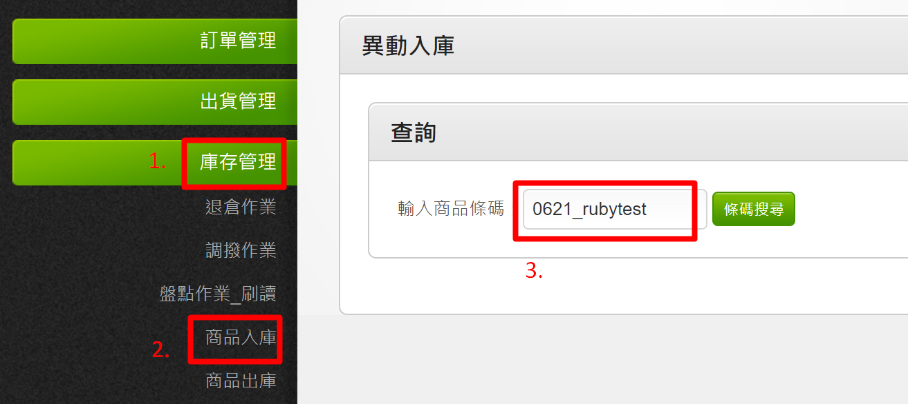

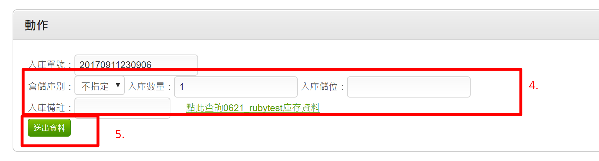

盤虧→商品出庫

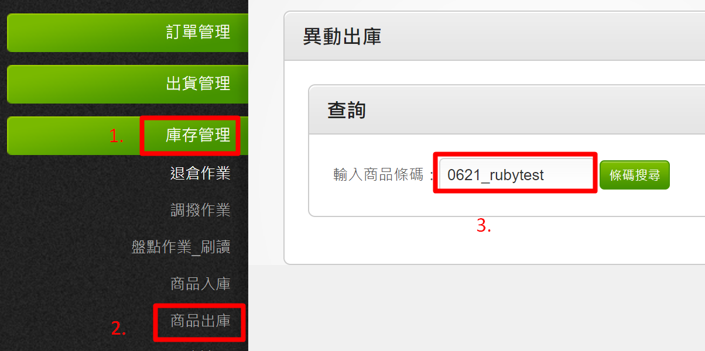

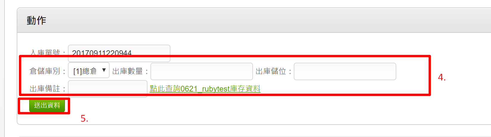

