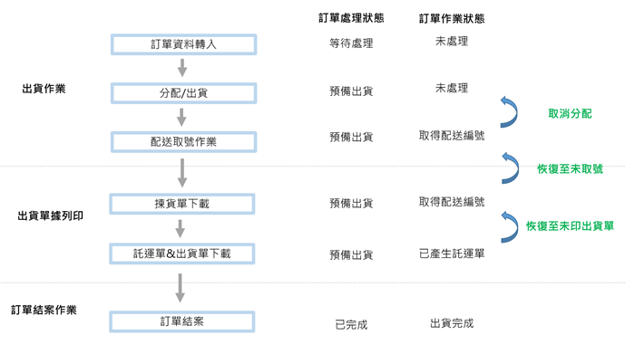
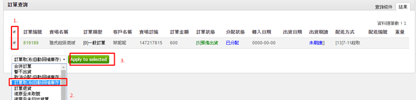
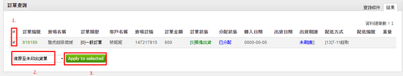
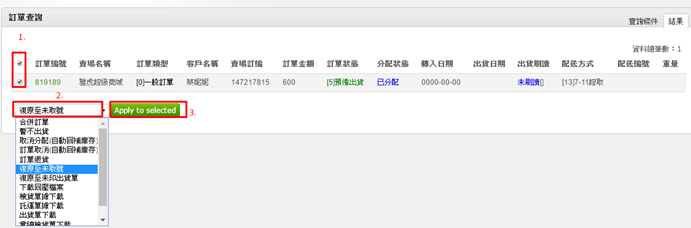

# 6-5 其他相關流程

訂單取消\_自動回補庫存

若訂單已經分配/取號\(未結案前\)，但還沒有出貨，客人取消訂單，可依圖操作

恢復至未印出貨單

於訂單尚未結案前，若是須重印出貨單，可依圖操作。

恢復至未取號

已經取號後的訂單發現問題，需要更改訂單內容  
輸入訂單號查詢→ 勾選訂單復原至未取號→輸入正確的資訊→重新取號

取消分配\_自動回補庫存

已經分配後\(已扣庫存\)的訂單，需要調整商品訂購數量or刪除商品，可依圖操作。

