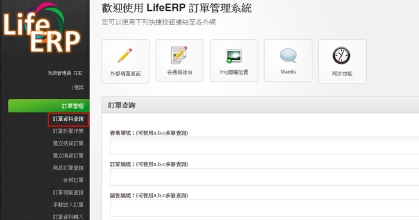
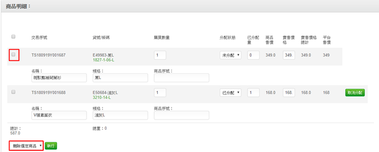
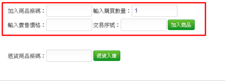

# 6-6  訂單更換商品

訂單資料查詢訂單資料

先將欲修改訂單查詢出來，若訂單狀態為5 預備出貨 0 未處理\(訂單已分配\)，需先取消分配回補庫存。

再於訂單明細內勾選欲更換的商品進行刪除

於商品明細下方新增商品，輸入商品條碼及數量價格即完成更換。

若訂單已轉至WMS，訂單狀態為8已轉至WMS時，需先請WMS刪除訂單，再異動此筆訂單明細。  
  
已轉入WMS的訂單，無法異動，需先將訂單狀態改回5預備出貨。  
於訂單資料查詢此筆訂單

點擊進訂單更新訂單狀態為5 預備出貨，再重新查詢訂單，下拉選擇取消分配回補庫存，即可進行訂單商品更新。  

