# 6-1 訂單出貨流程

系統登入後，顯示畫面在同步功能頁面

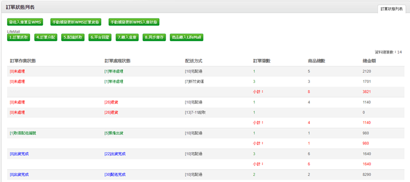

狀態說明

訂單轉入後尚未分配的訂單，訂單處理狀態為等待處理 訂單作業狀態為0 未處理

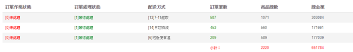

訂單轉入後，被分配的訂單，訂單處理狀態為5,6 預備出貨 訂單作業狀態為0 未處理

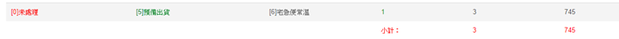

訂單分配後，已取得配送編號的訂單，訂單處理狀態為5,6 預備出貨 訂單作業狀態為1 已取得配送編號

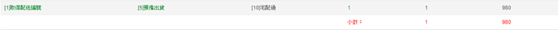

訂單分配後，已印完託運單的訂單，訂單處理狀態為5,6 預備出貨 訂單作業狀態為2 已產出託運單

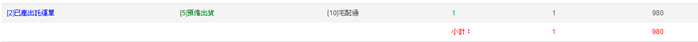

已出貨訂單，訂單處理狀態為22 出貨完成 訂單作業狀態為8 出貨完成

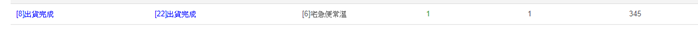

出貨流程

訂單管理→訂單資料轉入→訂單檔上傳\(csv\)→暫存表資料確認→執行轉入→分配庫存→彙總揀貨單列印→\(電子發票取號\)→出貨單據列印→出貨刷讀驗證→訂單結案

1. 訂單資料轉入

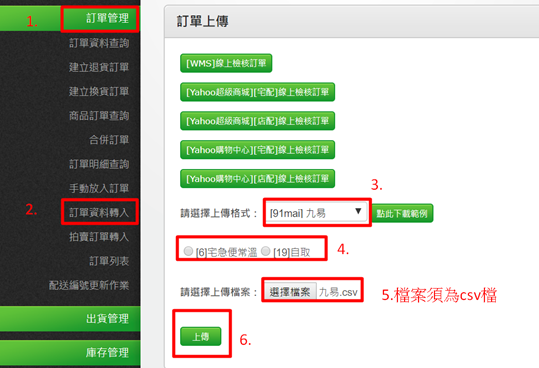

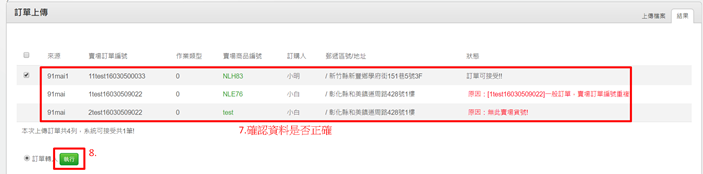

＊狀態說明

訂單可接受：代表此訂單無誤

賣場訂單編號重複：代表此筆訂單已有上傳過，避免重複上傳至系統

無此賣場貨號：代表此訂購的品項沒有於系統內建檔，請確認商品資料或訂單檔是否資料有誤

1. 分配/庫存

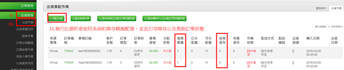

1. 取得配送編號

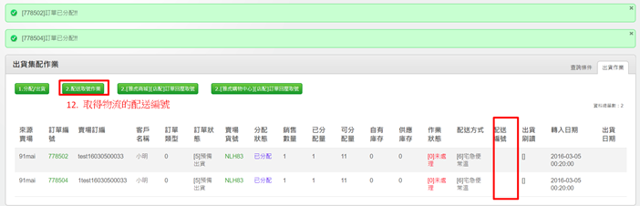

1. 彙總揀貨單列印&電子發票取號&出貨單據列印

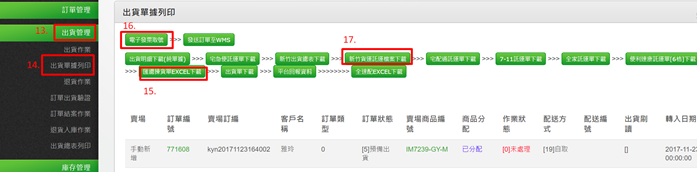

1. 出貨驗證刷讀

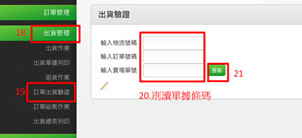

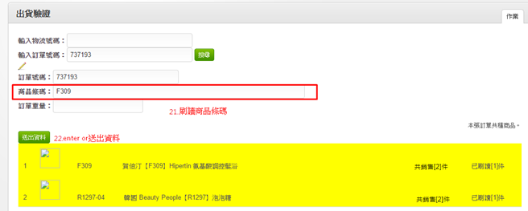

＊若訂單內品項A001購買數量為2件

當A001商品刷讀一件時，會呈現黃色，代表尚未刷讀完成

待刷讀完成後，會呈現藍色

如刷錯品項，系統會以提示聲來警示

1. 訂單結案

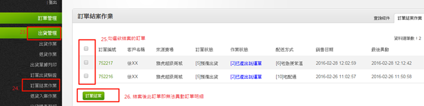

1. 出貨總表列印

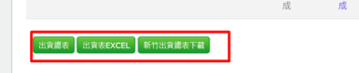

