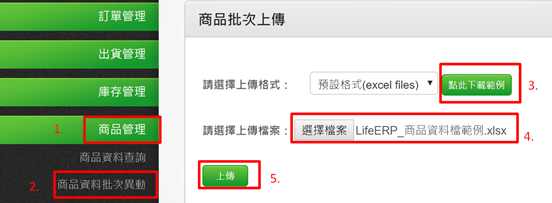
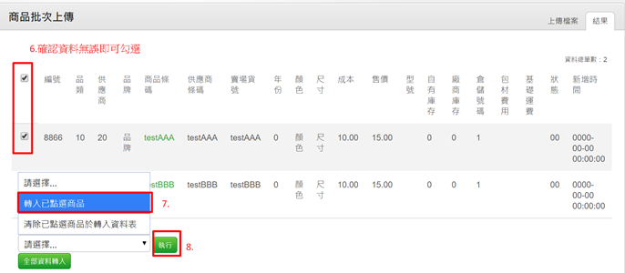
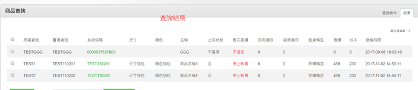
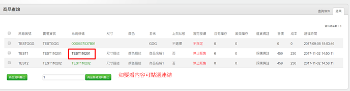

# 4-2 商品資料建立

商品管理→商品資料批次異動→上傳檔案→暫存表資料確認→執行轉入→查詢

查詢是否建立成功

商品資料批次異動範例檔說明

id：無須填寫，程式會自定義  
類別編號：若有填寫類別，則必須填寫此欄位，限制為五個字以內的數字  
類別：商品的類別  
供應商編號：若有填寫供應商，則必須填寫此欄位，限制為五個字以內的數字  
供應商：商品的供應商  
品牌編號：若有填寫品牌，則必須填寫此欄位，限制為五個字以內的數字  
品牌：商品的品牌  
商品條碼：**必填欄位**，商品的國際條碼，若無國際條碼，可與賣場條碼相同  
供應商條碼：**必填欄位**，商品與供應商叫貨的條碼，若無供應商條碼，可與賣場條碼相同  
賣場條碼：**必填欄位**，商品於各賣場上架的貨號，各賣場須統一此貨號，因訂單轉入後，程式是藉由訂單檔內的此資訊去對應系統內的商品  
商品名稱：**必填欄位**，商品的名字  
顏色：若有顏色以及尺寸可填寫於此  
商品敘述：若有特殊要註記的，可填寫於此  
尺寸：若有規格可填寫於此  
成本：商品的成本價  
售價：商品的售價  
廠商庫存：採購檔案上傳時必填，當採購時，需要在此欄位填寫採購數量  
自有庫存：第一次入庫存可在此填入庫存數字  
倉號：**必填欄位**，預設為1  
倉庫名稱：預設為公司倉  
建檔年分：建檔的年份

處理狀態：**必填欄位**，程式判別的更新狀態，定義如下

建檔日期：此商品建檔的日期  
業務姓名：此商品負責的業務  
儲位：若是商品有定義放置的地方，可輸入儲位號碼，在揀貨時單子會註明是在哪個儲位  
製造日期：此商品的製造日期，若不填，預設是2999-12-31  
有效日期：此商品的有效日期，若不填，預設是2999-12-31  
\(原供應商貨號\)：若有更改過供應商貨號，再此欄位填入原本的  
是否為組合商品：若是組合商品請填1，若不是，則無須填寫

安全庫存：商品的安全庫存，若是訂單庫存低於此安全庫存，即可出現於缺貨採購

