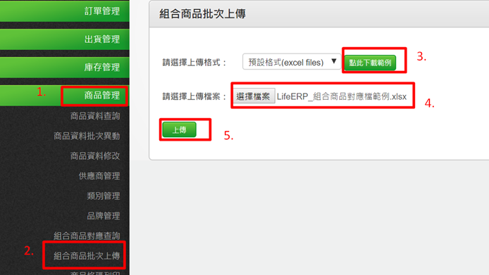
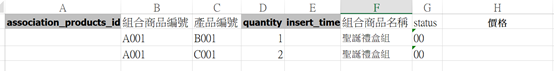
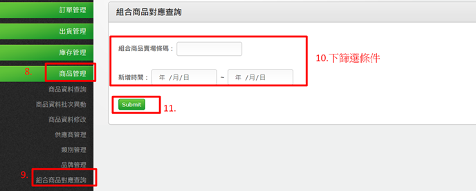
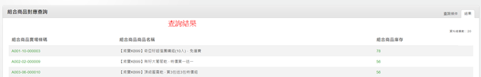

# 4-3 組合商品資料

商品管理→組合商品批次上傳→上傳檔案→暫存表資料確認→執行轉入→組合商品對應查詢

＊組合商品批次上傳範例檔說明

Ex:聖誕禮盒組\(A001\)=毛衣洋裝\(B001\)x1+褲襪\(C001\)x2

association\_products\_id：無須填寫，程式會自定義

組合商品編號：A001

產品編號：B001/C001

Quantity：1/2

insert\_time：無須填寫，程式會自定義

組合商品名稱：此系列的組合商品名稱

Status：00

價格：無須填寫  

查詢已建立組合商品

